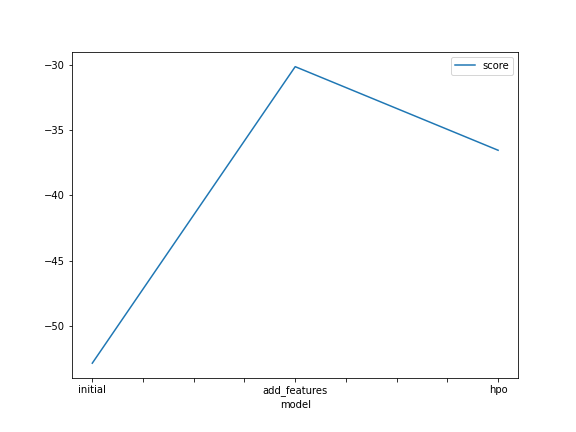

# Report: Predict Bike Sharing Demand with AutoGluon Solution
#### FARAH RIZKIAH

## Initial Training
### What did you realize when you tried to submit your predictions? What changes were needed to the output of the predictor to submit your results?
I realize that Kaggle will reject submission with negative values, so I run a `describe()` function to see the distribution of my prediction. The minimum value of the prediction is 3.07, so it's safe to submit because there are no negative value in my predictions.

### What was the top ranked model that performed?
The top ranked model was WeightedEnsemble_L3 with the score -52.840189.

## Exploratory data analysis and feature creation
### What did the exploratory analysis find and how did you add additional features?
I did an exploratory data analysis by creating a histogram to show the distribution of all features. I found that the datetime features would be more useful if I could extract additional information about the hour, day, and month. By using these new features, I could analyse the bike demand by hour of the day, day of the week, and month of the year to discover new information pattern.

### How much better did your model preform after adding additional features and why do you think that is?
The initial RMSE score from the first model is 1.79. By using the additional features I managed to significantly improve the model and gained the score of 0.65.

## Hyper parameter tuning
### How much better did your model preform after trying different hyper parameters?
I tried to further improved the model by tuning the hyperparameters. I specified hyperparameter values for individual model including neural network and LightGBM models. I also set the `hyperparameter_tune_kwargs` by playing around with `num_trials`, `scheduler`, and `searcher` hyperparameters. 

### If you were given more time with this dataset, where do you think you would spend more time?
TODO: I would try to explore the dataset and create additional features, and try more options on the hyperparameter tunings.

### Create a table with the models you ran, the hyperparameters modified, and the kaggle score.
|model|eval_metrics|time_limit|presets|num_bag_sets|individual model parameters|score|
|--|--|--|--|--|
|initial|RMSE|600|best_quality|None|None|1.79|
|add_features|RMSE|600|best_quality|None|None|0.65|
|hpo|RMSE|900|best_quality|1|None|0.49|

### Create a line plot showing the top model score for the three (or more) training runs during the project.

### Create a line plot showing the top kaggle score for the three (or more) prediction submissions during the project.

## Summary
This project is a great way for me to have a hands-on experience in building a machine learning model. I practice each aspect of ML workflow and build a model to predict the bike sharing demand using AutoGluon. I also learned how we could start by creating a baseline model using default parameters as an initial experiment, how to further improve the model with EDA and feature engineering, and perform hyperparameter tuning to optimize the model. I learned a lot from this project and I am excited to learn more.